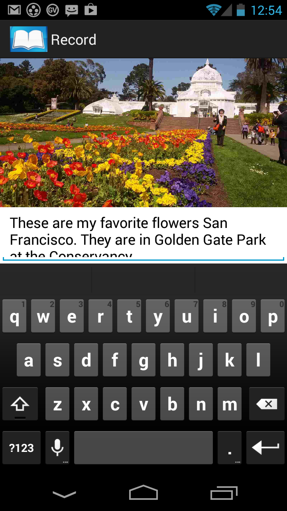

# Tell Me Stories Guide for Teachers 

*A mostly reasonable approach to JavaScript*

## <a name='TOC'>Table of Contents</a>

  1. [Types](#cloud)
  1. [Objects](#objects)
  1. [Arrays](#arrays)

 
 ## <a name='cloud'>Accept Cloud Storage</a>

  - **Required**: First time you start app after an install, you will be asked to confirm Cloud storage account.
 
  
   ## <a name='objects'>Provide a title</a>

  - **Required**: Type or speak a book title, click on the **Done** button
   
   ## <a name='arrays'>Types</a>

  - **Primitives**: When you access a primitive type you work directly on its value
 
