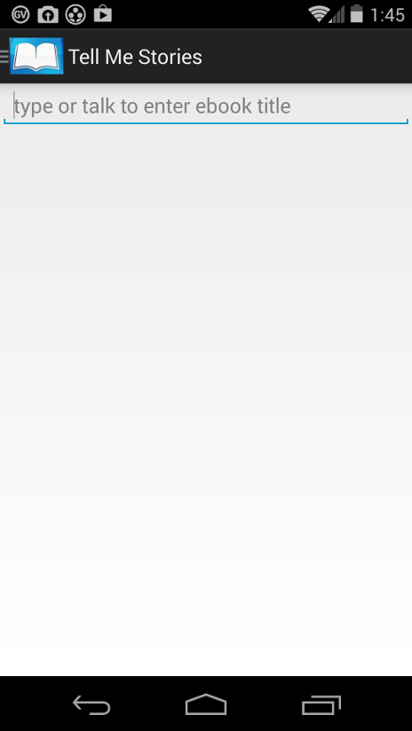

# Tell Me Stories Guide for Teachers 

*Installing the app. Creating new users using the app. And, using a separate 
webapp - Teacher moderated student groups for sharing stories.*

## <a name='TOC'>Table of Contents</a>

  1. [Installation](#install)
  1. [New Users](#users)
  1. [Class Groups](#groups)

 
 ## <a name='install'>Install the app</a>

  - **Required**: Following an install, the first time you start the app 
   you are asked to confirm Cloud a storage account. This page explains 
   the online media storage. A click on the blue button signals your agreement.
   The app then creates a single, anonymous user account which is all one 
   needs to experiment ( in the app's single user mode ) creating ebooks, excercising
   the apps features for readback and for editing the pages of books. See
   the section on **New Users** for a warning that the original , anonymous
   account can no longer be used after the first logon of an explicit 
   user account. The purpose of the anonymous account is to let you see
   how the app works without getting into the weeds of account creation. Outside
   the classroom with its requirement for multiple users on the same device,
   the mode for a single anonymous user on the device should suffice.
  
         
 
  - **Required**: Next, you will be prompted for the title of your first
 book. Tap in the input field at the top and the keyboard comes up. Type or
 activate the mic icon on the keyboard and
 talk and the title will appear. When you are done, click on the *Done* button
 in the upper right.
 
 
 
  - **Required**: The normal landing page below is what normally 
  comes up on startup or when you switch users. This is the Title page
  for your first book. From here, the app's controls are on the extreme left,
  on the upper left icon, or on the upper right control bar icons.
  You may slide out the menu from the extreme 
  left side to display all your books or select a book 
  related action from the options menus ( add pages, edit, share ... )
 
 
 
 At this point, if you just want to explore the app, you need read no 
 further.  [Youtube instructions](https://www.youtube.com/playlist?list=PLzLYnLHiwXuwaXrw1VoOoAjlp6FvDK3Ru)
 will help you create new pages in your ebook.
 See *new release main features* entry in the video play list for how
 to create and use ebooks using the app. You can do this with the single,
 anonymous user account. 
 
 The sections below cover adding additional students as users 
 in the app and admininstering the students in a class group.  
 
## <a name='users'>Create additional users</a>

  - **Optional**: In addition to the single anonymous user mentioned above,
  multiple users may share a classroom tablet whereby each student has 
  access to their own account via *logon*. Create new users using 
  the **+** icon on the action bar at the top right, 
  selecting **new user** from the dropdown. 
  Each new user will have to logon to the app. Once you create additional 
  users and logon using any of those new user accounts, the original, **anonymous 
  account can no longer be reached** - media created while you were experimenting
  will become unreachable. After you have created a new user account(s) for 
  students, you
  may switch
  between accounts by logging on a new user via the action bar menu. 
  
 
 
  - **Required**: fill in username and password.
 
  - **Optional**: fill in email if you are a teacher wishing to use 
 admin level of app priviledges for creating and controlling class groups.
 
 Tap the *create user* button. The app will post an alert that the 
 account was created. Repeat for additional students... And then remember
 to create a user account for the teacher - where email is **required**. 
 
 Not requiring student emails is a convenience with a cost...
 
 Forgetting a password for an account without an email currently means
 that password resets are impossible. You will just have to create new
 users and abandon the media connected to the old user.
 
 
   
  ## <a name='groups'>Class Groups</a>

  - **Admin features**: This uses a separate webApp accessible
  to users who supplied an email in the **New user** step and who then 
  authenticated using manual email reply. Using the app, create a new user for a teacher
  where the email is provided on the new user panel. Click the button to 
  submit the new user and then go into your email inbox
  where you will find a mail item from **parseapps.com**.  Respond with a click on 
  the enclosed link and you should be good to go with the admin steps below.
  
  - **Logon to the Webapp**: Using a browser, [go here](https://tellmestories.parseapp.com "Webapp")
  for a logon screen where you will use **name and password** from the teacher account created above. 
  Note that application accounts 
  with authenticated emails can logon to the webapp with the same 
  credentials used in the tablet app **Tell Me Stories**. On the initial login, new users will 
  see the panel below. 
   
 

  - **Type in a group**: Put the cursor in the field ( or tap the field) 
  labeled "Type-new-groups..". Input a unique name for your Group. Note that you may
  want to include town or city, school name in the group name. Other 
  how to examples use group names like "SanFran_strKing_6th_smith" for a
  class group. 
  
 
 
  - **Enter**: hit the enter key and your group is created. Screen update
  adds new line reflecting  the new group.
   
   

  - **Open the new group**: click on the text or on the icon  to 
  the left on the new group line. This opens up the panel below below where
  you enter the usernames (one at a time) belonging to students you wish to include in the group. 
   
  

  - **Type user names**: Put the cursor over the top of the field
  labeled *Type-Group-Members...* Input user name and hit enter key.
  A new detail line will appear with that user.
  User name must match an existing user name as it was created in the *Tell Me Stories* 
  app using the plus menu and "new user".  
   
 

  - **Repeat**: Input the rest of the students in the class using the 
  name they registered for themselves over in the Tell Me Stores app. Don't
  forget to add the teacher to group so they will have access to media
  created by the students in the group. Here, with 3 students and a teacher
  any media created in Tell Me Stories by any of these 4 users can be 
  shared to the group by accessing the **Share** menu in the app.    
   
 
